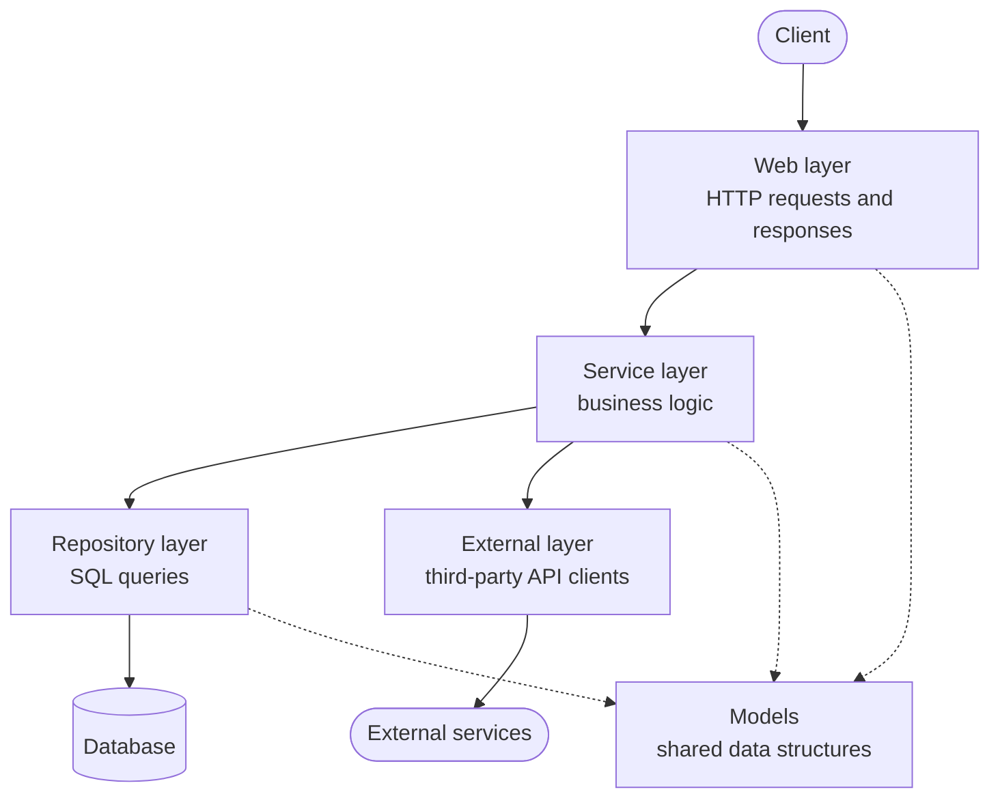

This project follows a layered controller-service-repository architecture.

```mermaid
flowchart TD
    Client([Client])
    Web["Web layer<br/>HTTP requests and responses"]
    Service["Service layer<br/>business logic"]
    Repository["Repository layer<br/>SQL queries"]
    External["External layer<br/>third-party API clients"]
    Models["Models<br/>shared data structures"]
    Database[(Database)]
    ExternalServices([External services])

    Client --> Web
    Web --> Service
    Service --> Repository
    Service --> External
    Repository --> Database
    External --> ExternalServices
    Web -.-> Models
    Service -.-> Models
    Repository -.-> Models
```