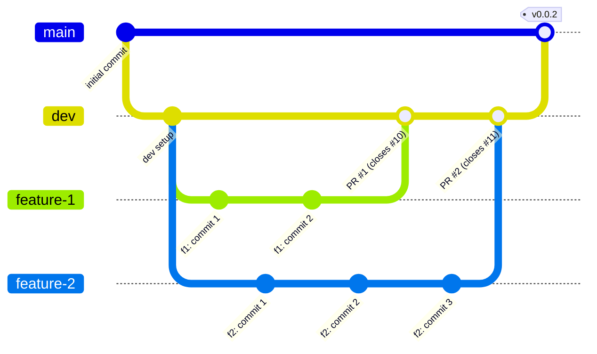

### Branching Strategy

- Work in this repository is done using feature-branching, with continous integration into the `dev` branch.
- A feature-branch should be created with reference to a specific GitHub issue.
- Before a pull-request is made, the developer of the feature-branch should verify that the feature works as intended and passes all tests (when implemented).
- Once work on a branch is completed, a pull-request into `dev` can be made, and the PR-template filled out.
- The PR-template should describe the what & why of the changes made, and reference the issue that it closes.
- A pull-request should be merged only after review from at least one other team member.

The general workflow is shown in the branch diagram below:

